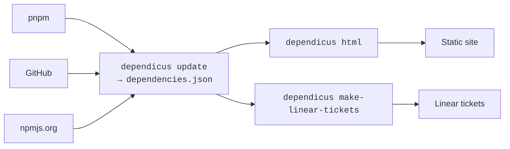

# Dependicus

Dependicus is a dependency governance tool for JavaScript monorepos. It pulls data from your pnpm lockfile, the npm registry, and GitHub, then produces an interactive dashboard and Linear tickets so you can make informed decisions about your dependency graph at an organizational scale.

If you maintain a monorepo with multiple teams, dozens of workspace packages, and hundreds of dependencies, Dependicus gives you the visibility that automated-PR tools don’t: which packages are behind, by how much, who owns them, and where teams have drifted to different versions of the same dependency. You can see our [own dashboard](../dependencies/index.html) for a sense of what it looks like in practice.

Dependicus has a plugin system so you can customize it to your unique needs. It’s a young open source project, but we use it daily at [Descript](https://descript.com).



Today, Dependicus only supports pnpm, but the discussion is open for adding additional package managers.

## Quickstart

You only need to run a couple of commands to see whether Dependicus is useful to you. First, collect the data and generate the static site.

```sh
export GITHUB_TOKEN=<a GitHub token> # speeds up fetching of changelogs and tags
pnpm dlx dependicus@latest update --html
# open ./dependicus-out/index.html
```

If you’re a Linear shop, you can reuse the same data to create tickets when updates are available. The default behavior is very naive, so this example uses `--dry-run` just to give you a sense of what would happen.

```sh
export LINEAR_API_KEY=<a Linear API key>
pnpm dlx dependicus@latest make-linear-tickets \
    --linear-team-id=<uuid of a Linear team> \
    --dry-run
```

Dependicus offers extensive customization through its JavaScript API. Read on to find out how!

## LLM usage disclaimer

We use coding agents as part of the process of working on Dependicus. It’s not vibecoded; the architecture reflects our human intent, and changes are reviewed carefully. But if you’re avoiding software written with the assistance of LLMs, Dependicus is not a good fit for you.
