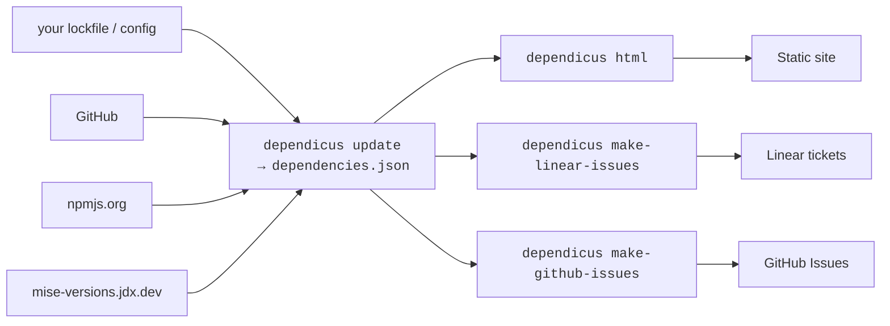

# What is Dependicus?

Dependicus is a dependency governance tool for monorepos. It pulls data from your lockfile (or tool config), the npm registry, and GitHub, then produces an interactive dashboard, Linear tickets, and GitHub Issues so you can make informed decisions about your dependency graph at an organizational scale.

If you maintain a monorepo with multiple teams, dozens of workspace packages, and hundreds of dependencies, Dependicus gives you the visibility that automated-PR tools don't: which packages are behind, by how much, who owns them, and where teams have drifted to different versions of the same dependency. You can see [our own dashboard](../dependencies/index.html) for a sense of what it looks like in practice.

Dependicus has a plugin system so you can customize it to your unique needs. It's a young open source project, but we use it daily at [Descript](https://descript.com).

Dependicus supports [pnpm](https://pnpm.io/), [bun](https://bun.sh/), [yarn](https://yarnpkg.com/), [npm](https://www.npmjs.com/), and [mise](https://mise.jdx.dev/) as dependency providers, with auto-detection of the active one. See [Package Managers](./package-managers.md) for details.

## LLM usage disclaimer

We use coding agents as part of the process of working on Dependicus. It's not vibecoded; the architecture reflects our human intent, and changes are reviewed carefully. But if you're avoiding software written with the assistance of LLMs, Dependicus is not a good fit for you.
